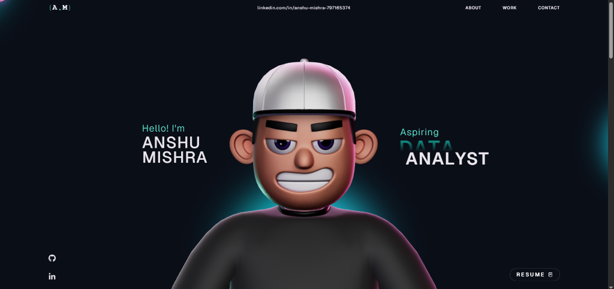

# Anshu | Data Science & ML Portfolio

This repository contains the source code for my interactive, 3D personal portfolio built with React, TypeScript, Three.js, React Three Fiber, and GSAP. It showcases my data science, machine learning, and BI projects through animated page sections, a custom 3D character scene, and smooth transitions designed for a modern storytelling experience.



## Table of Contents

- [Features](#features)
- [Tech Stack](#tech-stack)
- [Project Structure](#project-structure)
- [Getting Started](#getting-started)
- [Deployment](#deployment)

## Features

- **Data Science Showcase**: Dedicated sections highlighting end-to-end ML, ETL, and BI projects (e.g., Crop Yield Prediction, E-Commerce Sales Analysis).
- **Interactive 3D Experience**: A custom 3D character scene rendering powered by React Three Fiber and Three.js.
- **GSAP Animations**: Fluid scroll-driven animations and transitions for interactive storytelling.
- **Responsive Layout**: One-page portfolio layout optimized for desktop, tablet, and mobile viewing.
- **Custom Aesthetic**: Unique "manifesto-style" typography, glassmorphism, and dark-mode color palettes tailored for a premium data science aesthetic.

## Tech Stack

### Frontend & Core
- React 18
- TypeScript
- Vite

### Animation & 3D Environment
- GSAP + `@gsap/react`
- Three.js
- `@react-three/fiber`
- `@react-three/drei`
- `@react-three/postprocessing`

### Supporting Libraries
- `react-icons`
- `react-fast-marquee`
- `@vercel/analytics`

## Project Structure

```text
.
├── public/                    # Static assets (3D models, project screenshots)
├── src/
│   ├── assets/                # Local media/assets
│   ├── components/
│   │   ├── Character/         # 3D scene + character logic/utilities
│   │   ├── styles/            # Section/component CSS files
│   │   ├── About.tsx          # Personal manifesto and bio
│   │   ├── Career.tsx         # Education and experience timeline
│   │   ├── Contact.tsx        # Contact links and resume
│   │   ├── Landing.tsx        # Hero section
│   │   ├── MainContainer.tsx  # Main page composition
│   │   ├── TechStack.tsx      # Python, SQL, ML, BI tools
│   │   ├── WhatIDo.tsx        # Core competencies
│   │   └── Work.tsx           # Case studies and project showcase
│   ├── App.tsx
│   └── main.tsx
├── package.json
└── vite.config.ts
```

## Getting Started

### Prerequisites

- Node.js 18+ (recommended)
- npm 9+ (or compatible)

### Installation

1. Clone the repository:
   ```bash
   git clone https://github.com/h4anshu/YOUR-REPO-NAME.git
   cd portfolio
   ```

2. Install dependencies:
   ```bash
   npm install
   ```

3. Start the local development server:
   ```bash
   npm run dev
   ```

4. Open the URL shown in your terminal (typically `http://localhost:3000`).

## Deployment

This portfolio is optimized to be deployed seamlessly on **Vercel**. 

1. Create a production build locally to verify there are no errors:
   ```bash
   npm run build
   ```
2. Push your code to GitHub.
3. Log into [Vercel](https://vercel.com/) with your GitHub account, click "Add New Project", select this repository, and click **Deploy**. Vercel will automatically detect Vite and host the site!

## License

This project is available under the MIT License.
